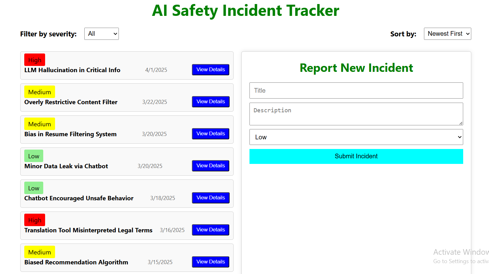

# AI Safety Incident Dashboard

## Project Description

This project is an interactive dashboard for managing AI safety incidents.  
Built with **React** and **TypeScript**, it allows users to:
- View a list of incidents (Title, Severity, Reported Date)
- Filter incidents by severity (All, Low, Medium, High)
- Sort incidents by reported date (Newest First, Oldest First)
- Expand to view full descriptions
- Report new incidents using a form with basic input validation

The dashboard is responsive using Flexbox and Grid layouts, with basic clean styling using CSS.

---

## Technologies Used

- React
- TypeScript
- HTML
- CSS

---

## 📸 Screenshots

<table>
  <tr>
    <td align="center">
      <br/>
      <strong>Interface Screen/strong>
    </td>
  </tr>
</table>


## How to Install and Run

1. **Clone the Repository:**
   ```bash
   git clone hhttps://github.com/12narendra45/sparklehood.git
   ```

2. **Navigate to the project directory:**
   ```bash
   cd ai-safety-incident-dashboard
   ```

3. **Install dependencies:**
   ```bash
   npm install
   ```

4. **Run the development server:**
   ```bash
   npm run dev
   ```
   or
   ```bash
   npm start
   ```

5. Open your browser and go to `http://localhost:3000` to view the dashboard.

---

## Design and Implementation Notes

- Used React `useState` hooks for state management of filtering, sorting, expanding descriptions, and form handling.
- Added basic form validation to ensure non-empty fields when submitting a new incident.
- Used Flexbox and Grid for creating a responsive layout.
- Defined TypeScript interfaces for strong typing and better code maintenance.

---

## Project Structure

```
/src
  ├
  │── data.json  
  │── Mainapp.tsx
  │── store.ts   
  │── reducer.ts
  ├── App.tsx
  ├── index.tsx
  ├── style.css
/public
  └── index.html
```

---

## Author

- [Github Link](https://github.com/12narendra45)

---

## Assignment Link

- [Github Link](https://github.com/12narendra45/sparklehood)


